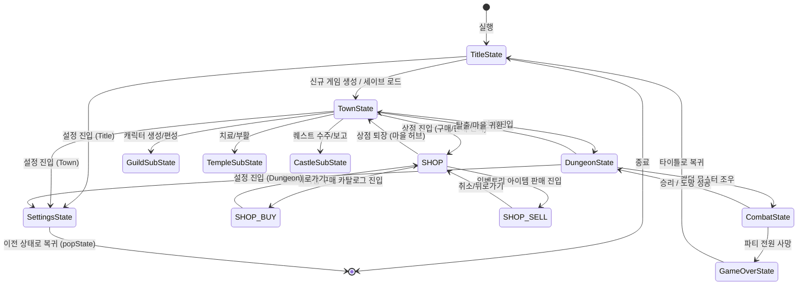

# spec.md (마스터 스펙 & 설계 마스터플랜)

## 1. 문서 운영 규칙
* 본 문서는 프로젝트 **Crawlmaster**의 절대적인 마스터플랜(Master Plan)이다.
* 모든 코드 구현, 설정 파일, 그리고 `designs.md`, `implementation_summary.md` 등의 하위 문서는 본 문서의 사양을 엄격히 준수해야 한다.
* 사양이 변경되거나 확장될 경우, 코드 수정을 진행하기 전에 반드시 본 문서를 먼저 갱신하여 정합성을 유지한다.
* 모든 주석 및 문서는 **한국어**로 작성하는 것을 원칙으로 한다. (README.md만 다국어 지원)

## 2. 프로젝트 정체성
* **프로젝트명:** Crawlmaster (크롤마스터)
* **장르:** 1인칭 그리드 기반 3D 던전 탐험 RPG (Classic Wizardry 및 d20 D&D 5e 룰 기반)
* **플랫폼/기술:** C++20, SFML (Simple and Fast Multimedia Library)를 이용한 그래픽/입력 처리 및 1인칭 와이어프레임 소프트웨어 3D 렌더링.
* **현재 제품 lane:** 정식 출시 이전의 **한 층짜리 상용 데모 후보**. Early Access 및 1.0 출시 완료를 주장하지 않는다.
* **대상 사용자:** 키보드 중심의 고전 던전 탐험, 파티 구성, 턴제 d20 전투를 선호하는 싱글 플레이 사용자.
* **검증 플랫폼:** Ubuntu 24.04 x86_64와 그 ABI/runtime 요구사항을 충족하는 Linux. X11/Xrandr/Xcursor/udev/FreeType/OpenGL 런타임이 필요하다. Windows Server 2022 hosted MSVC build/test/package/startup은 source `4f988483bf5cbcfdce4c79a6aabab4a67a7043f9`에서 검증했다. clean Windows 10/11의 VC++ runtime 전제, high-DPI와 장시간 실기는 `UNVERIFIED`, macOS는 현재 범위 밖이다.
* **가격 정책:** 미정(TBD). 배포·권리·접근성 gate가 닫히기 전에는 유료 출시 가능 상태로 표시하지 않는다.
* **주요 목표:** 마을 정비 -> 한 층 탐험 -> 랜드마크/보상 -> 최종 전투 -> 결과 화면으로 이어지는 완결 가능한 수직 슬라이스와 D&D 5e 스타일 캐릭터 시뮬레이션.

## 3. 목표와 성공 기준
* **목표:**
  * SFML 창(window) 내에서 20x20 크기의 랜덤 생성 미로를 1인칭 원근 와이어프레임 뷰로 렌더링하고 키보드 입력(W, A, S, D 또는 방향키)으로 끊김 없이 전후 이동 및 90도 회전이 가능해야 함.
  * D&D 5e 스타일의 캐릭터 시트(6대 능력치, 보정치, HP, AC, 클래스별 특화 스킬 및 주문 슬롯)를 구현.
  * 마을(Town)의 길드(Guild), 상점(Shop), 교회(Temple), 퀘스트 보드(Castle/Camp) 간의 화면 전이 및 상태 동기화 완료.
  * 적 조우 시 턴제 전투(Combat) 모드로 진입하며, d20 주사위 굴림(명중 굴림 vs AC)을 활용한 전투 시스템이 작동해야 함.
  * JSON 기반의 파티 데이터 저장/불러오기(Save & Load) 기능 지원.
  * 추상 인터페이스를 통해 향후 아이템, 몬스터, 스킬, 장비 확장이 코어 시스템의 수정 없이 가능하도록 패키징.
* **성공 기준 (완료 정의):**
  * 게임을 실행하여 캐릭터 4명을 생성하고 파티를 짠 후 저장할 수 있다.
  * 던전에 진입하여 무작위로 생성된 20x20 미로를 1인칭 3D 와이어프레임으로 탐험할 수 있다.
  * 미니맵에 방문한 벽과 바닥이 정상 표시되며, 밟은 바닥은 네온 그린으로 하이라이트된다.
  * 미니맵의 탐험된 빈 바닥을 마우스로 클릭하면 BFS 최단 경로를 따라 벽을 우회하며 0.1초 간격으로 한 칸씩 자동 이동한다.
  * 던전 내에서 몬스터를 조우하여(자동 이동 도중 포함) 턴제 전투를 통해 무찌르거나 도망칠 수 있다.
  * 수집한 아이템이나 몬스터 처치 수를 기반으로 퀘스트를 완료하고 마을 상점에서 장비를 매매한 뒤, 캐릭터 상태가 세이브 파일에 정상 반영된다.
  * **[v0.8.0 추가]** 파티 인벤토리에 추가된 버프 물약, 해독 스크롤, 마나 물약 등을 사용해 상태이상을 치료하거나 주문 슬롯을 채우고, 전투 중에 습득한 다양한 스킬 및 주문을 선택하여 발동할 수 있다.
  * 던전의 랜드마크와 최종 목표에 도달하여 보스 전투를 끝내고 결과 화면을 확인할 수 있다. 한 런의 설계 목표는 30~60분이며 실제 플레이테스트 전까지 이 수치는 `UNVERIFIED`다.
  * 타이틀에서 New Game과 Continue가 분리되고, 파괴적 초기화는 확인 전에는 실행되지 않는다.
  * 타이틀 화면 및 게임 플레이 도중 설정(Settings) 화면에 진입할 수 있으며(단축키: O키), 5개 국어(한국어, 영어, 일본어, 중국어 번체/간체) i18n 실시간 전환과 조작 가이드를 제공한다.
  * Debug/Release 빌드, 등록된 CTest, Linux 재배치 패키지 smoke가 모두 통과해야 데모 후보로 판정한다. Windows hosted gate는 통과했지만 clean Windows 10/11 runtime과 실제 high-DPI/장시간 실기 gate 전에는 상용 지원 플랫폼 PASS로 승격하지 않는다.

## 4. 비목표 (Non-Goals)
* 실시간 3D 그래픽스 및 텍스처 매핑 (와이어프레임 3D 및 단순 평면 드로잉만 적용).
* 네트워크 멀티플레이어 (싱글 플레이 파티 RPG로 한정).
* 복잡한 물리 엔진 및 실시간 충돌 판정 (그리드 좌표 충돌 및 단순 주사위 판정으로 한정).
* 사운드 이펙트 및 BGM (SFML Audio 모듈 사용은 사양에서 배제, 향후 확장 스펙으로 격리).
* D&D 5e of 모든 피트(Feats), 서브클래스, 5레벨 이상의 고레벨 마법 (최대 3레벨 캐릭터 레벨 및 1~2레벨 주문/스킬로 고정).

## 5. 동결된 핵심 결정
* **화면 해상도:** 1024x768 고정 해상도 (SFML RenderWindow).
* **그래픽스 스타일:** 레트로 벡터/와이어프레임 흑백 또는 녹색 계열 (그린 스크린 룩앤필)의 네온 와이어프레임 스타일.
* **렌더링 방식:** 현재 플레이어의 위치와 바라보는 방향 벡터를 기준으로 전방 최대 4칸(시야 거리)의 그리드 벽 데이터를 투영 계산하여 SFML `sf::VertexArray` (Lines/LineStrip)로 직접 투영 및 선 그리기.
* **파티 인원:** 최대 4인 파티 구성.
* **세이브 포맷:** UTF-8 JSON 파일 (`save.json`).
* **세이브 시점:** 마을과 종결 결과에서만 checkpoint를 기록한다. 활성 던전 좌표/FOW/전투 중간 재개는 데모 범위에서 지원하지 않는다.
* **TPK:** 현재 던전 런만 종료하고 마지막 정상 town checkpoint를 복구한다. TPK가 정상 저장 파일을 삭제하거나 덮어쓰지 않는다.
* **난이도/판정:** 프로세스 세션이 소유하는 하나의 `std::mt19937` stream을 사용한다. 시작 seed는 로그와 저장 메타데이터에 남기며 테스트에서 주입할 수 있어야 한다.
* **오디오:** 현재 비목표다. 실제 오디오 구현 전까지 BGM/SFX 볼륨을 작동하는 설정처럼 노출하지 않는다.

## 6. 기술 스택과 아키텍처 원칙
* **언어 표준:** C++20 (`std::format`, `std::ranges`, `std::jthread` 등 현대적 C++ 기능 적극 활용)
* **외부 라이브러리:** SFML 2.6.x (Window, Graphics, System), nlohmann/json (JSON 파싱 및 직렬화용 헤더온리 라이브러리)
* **컴파일러 & 빌드 툴:** CMake 3.28 이상, GCC 11 이상 또는 MSVC 2022 이상.
* **아키텍처 패턴:** MVC (Model-View-Controller) 패턴을 차용한 상태 엔진 구조.
  * **Model:** 게임 데이터 (Character, Party, Inventory, Map, Monster, Quest, Skill)
  * **View:** SFML 기반 `DungeonRenderer`. Town/Combat/CharacterInfo/Settings 화면은 현재 각 State가 직접 렌더링하며, 존재하지 않는 renderer를 책임 파일로 문서화하지 않는다.
  * **Controller:** GameStateManager 및 각 State별 입력 핸들러 (TitleState, TownState, DungeonState, CombatState, CharacterInfoState)
* **메모리 관리:** raw pointer 사용을 최소화하고 `std::unique_ptr` 및 `std::shared_ptr`으로 소유권을 표현하며, 테스트와 도구로 수명 오류를 점검한다.

## 7. 런타임/빌드 파이프라인
* **의존성 설치:** CMake FetchContent의 immutable commit pin으로 SFML 2.6.1과 nlohmann/json 3.11.3을 가져오며 시스템 패키지 우선 탐색으로 빌드 결과가 달라지지 않게 한다.
* **빌드 출력 경로:** 프로젝트 루트 하위의 `build/` 디렉터리에 아웃풋 바이너리 생성.
* **자산(Asset) 경로:** 개발 빌드는 빌드 트리의 `assets/`, 설치 빌드는 실행 파일 기준 `../share/crawlmaster/assets/`를 사용한다. process CWD에 의존하지 않는다.
* **사용자 데이터 경로:** Linux는 `$XDG_DATA_HOME/crawlmaster` 또는 `$HOME/.local/share/crawlmaster`, Windows는 `%APPDATA%/Crawlmaster`를 사용한다. 테스트만 명시 경로를 주입한다.

## 8. 디렉터리 구조
```text
crawlmaster/
├── CMakeLists.txt              # CMake 빌드 정의
├── README.md                   # 다국어 리드미
├── spec.md                     # 마스터 설계 스펙 (본 파일)
├── designs.md                  # UI 디자인 명세
├── CHANGELOG.md                # 변경 이력
├── BUILD_GUIDE.md              # 빌드 및 실행 가이드
├── IMPLEMENTATION_SUMMARY.md   # 구현 요약 및 파일 책임
├── DESIGN_DECISIONS.md         # 결정 이력 및 대안
├── audit_roadmap.md            # 로드맵 및 테스트 프로세스
├── assets/                     # 폰트, 스프라이트 등 정적 리소스
│   └── fonts/
│       ├── UbuntuMono[wght].ttf # UFL-1.0 영문 폴백
│       ├── neodgm.ttf           # 복고풍 한/영 공용 폰트
│       └── NotoSansCJK-Regular.ttc # OFL-1.1 혼합 CJK/ASCII 폰트
├── include/                    # 헤더 파일 (.hpp)
│   ├── core/                   # 게임 핵심 루프 및 상태 관리
│   ├── model/                  # D&D 규칙, 캐릭터, 몬스터, 아이템, 퀘스트, 스킬
│   ├── view/                   # SFML 소프트웨어 3D 및 UI 렌더링
│   └── controller/             # 각 상태별 입력 및 이벤트 로직
└── src/                        # 소스 코드 파일 (.cpp)
    ├── main.cpp
    ├── core/
    ├── model/
    ├── view/
    └── controller/
```

## 9. 핵심 동작 정의 (State Machine)
게임은 다음의 유한 상태 기계(FSM)로 관리된다.



## 10. 시스템 명세

### 10.1 캐릭터 모델 및 D&D 룰 명세
* **능력치 (Abilities):**
  * `STR` (근력), `DEX` (민첩), `CON` (건강), `INT` (지능), `WIS` (지혜), `CHA` (매력)
  * 능력치에 따른 보정치 공식: `Modifier = floor((Score - 10) / 2)`
* **클래스 (Class) 상세 정의:**
  * **전사 (Warrior):** Hit Die `d10`. 주 능력치 `STR`. 초기 장비: 롱소드, 스케일 메일. 특화 스킬: 레벨업에 따라 Slash (`skl_slash`), Shield Bash (`skl_shield_bash`), Cleave (`skl_cleave`) 습득.
  * **마법사 (Mage):** Hit Die `d6`. 주 능력치 `INT`. 초기 장비: 마법 지팡이, 로브. 특화 스킬: 레벨업에 따라 Magic Missile (`spl_magic_missile`), Sleep (`spl_sleep`), Fireball (`spl_fireball`) 주문 습득. 1레벨 주문 슬롯 2개로 시작하여 레벨당 증가.
  * **도적 (Rogue):** Hit Die `d8`. 주 능력치 `DEX`. 초기 장비: 단검, 가죽 갑옷. 특화 스킬: 레벨업에 따라 Sneak Attack (`skl_sneak_attack`), Poison Dart (`skl_poison_dart`), Shadowstrike (`skl_shadowstrike`) 습득.
  * **성직자 (Cleric):** Hit Die `d8`. 주 능력치 `WIS`. 초기 장비: 메이스, 체인 메일, 방패. 특화 스킬: 레벨업에 따라 Cure Wounds (`spl_cure_wounds`), Bless (`spl_bless`), Prayer of Healing (`spl_prayer_of_healing`) 주문 습득. 1레벨 주문 슬롯 2개로 시작하여 레벨당 증가.
* **전투 스탯:**
  * `AC` (Armor Class, 방어도): `10 + DEX 보정치 + 장착 갑옷 AC 보너스 + 장착 방패 AC 보너스`
    * 단, 체인 메일(`arm_chain`) 착용 시 DEX 보정치 없이 고정 AC 16.
    * 플레이트 아머(`arm_plate`) 착용 시 DEX 보정치 없이 고정 AC 18.
    * 스케일 메일(`arm_scale`) 착용 시 DEX 보정치는 최대 +2까지만 가산.
  * `HP` (Hit Points, 체력): 레벨업 시 `Hit Die + CON 보정치` 만큼 누적 증가. (최소 1 보장)
  * `Proficiency Bonus` (숙련 보너스): 1~3레벨 모두 `+2`로 유지.
* **캐릭터 상태이상 및 버프 상태 관리 (v0.8.0 추가):**
  * **상태이상:**
    * **독 (Poison):** 매 전투 턴 시작 시 캐릭터는 `1d3`의 독 지속 피해를 입음. 지속 시간(턴수)이 다하면 해제됨.
    * **마비 (Paralysis):** 턴 시작 시 행동 불가가 되어 자신의 차례를 스킵함. 매 턴 시작 시 1턴씩 차감.
  * **버프:**
    * **STR 버프 / DEX 버프:** 버프 물약 복용 시 적용. 해당 능력치 실시간 수치에 `+3` 보정치를 더함. (전투 중에만 지속, 전투 종료 시 자동 만료)
    * **Bless (축복):** 성직자 주문 효과. 모든 공격 명중 굴림(Attack Roll)에 `+2` 보너스 획득.

### 10.2 던전 생성 및 1인칭 렌더링 명세
* **던전 맵 데이터:**
  * 크기: 20x20 2차원 배열.
  * 셀 구성요소: `Wall` (벽), `Empty` (이동 가능 바닥), `Door` (문), `UpStairs` (마을로 복귀하는 입구 계단).
  * 생성 알고리즘: DFS 기반 미로 생성 및 임의 벽 해제를 통한 루프(Loop)화.
* **1인칭 와이어프레임 투영 알고리즘:**
  * 플레이어 격자 좌표 및 방향에 따른 전방 N(1~4) 칸 벽면 원근 와이어프레임 렌더링.
  * 수직선 높이: $H(d) = ScreenHeight / (d + 1)$, 폭: $W(d) = ScreenWidth / (d + 1)$.

### 10.3 전투 시스템 (Combat System) 명세
* **턴 순서 (Initiative):**
  * 전투 시작 시 `1d20 + DEX 보정치`를 굴려 높은 순으로 행동.
* **명중 판정 (Attack Roll):**
  * `1d20 + 관련 보정치(STR/DEX) + 숙련 보너스(Proficiency) + 버프(Bless 등)`가 대상의 `AC` 이상이면 명중.
  * 주사위 자연수 20은 치명타(두 번의 피해 주사위 굴림), 자연수 1은 무조건 빗나감.
* **피해 판정 (Damage Roll):**
  * 공격 명중 시 무기 피해 주사위 + 능력치 보정치만큼 대상 HP 차감. 0 이하 시 사망.
  * 무기 피해 타입은 `SLASHING`, `PIERCING`, `BLUDGEONING` 중 하나다.
  * `mon_skeleton`은 참격/관통 최종 피해를 `floor(damage * 0.5)`로 감쇄하고 타격 피해는 그대로 받는다.
  * 명중 굴림을 사용하는 Slash, Shield Bash, Cleave, Sneak Attack, Poison Dart, Shadowstrike는 일반 공격과 같은 `CombatRules` 명중·자연 1/20·Bless·피해 타입·저항 경로를 사용한다.
  * 무기 기반 Skill은 장착 무기의 dice count/sides/type을 보존한다. Skill 고유 attack bonus, flat damage bonus와 extra dice만 공통 계산에 추가한다.

### 10.4 퀘스트 시스템 명세
* **퀘스트 구조:**
  * ID, 이름, 타입(`KILL`, `COLLECT`), 대상 ID, 목표 수량, 현재 진행 수량, 골드/경험치 보상.

## 11. 경계 타입과 계약 (Typed Contracts)

```cpp
// 1. 캐릭터 클래스 선언 타입
enum class CharacterClass {
    WARRIOR,
    MAGE,
    ROGUE,
    CLERIC
};

// 2. 능력치 구조체
struct AbilityScore {
    int strength = 10;
    int dexterity = 10;
    int constitution = 10;
    int intelligence = 10;
    int wisdom = 10;
    int charisma = 10;
    
    int getModifier(int score) const {
        int diff = score - 10;
        return (diff < 0) ? (diff - 1) / 2 : diff / 2;
    }
};

// 3. 아이템 추상 인터페이스
class Item {
public:
    virtual ~Item() = default;
    virtual std::string getId() const = 0;
    virtual std::string getName() const = 0;
    virtual int getGoldValue() const = 0;
    virtual std::string getDescription() const = 0;
    virtual bool isEquipment() const = 0;
};

// 4. 장비 아이템 파생 인터페이스
enum class EquipSlot {
    WEAPON,
    ARMOR,
    SHIELD,
    ACCESSORY
};

class Equipment : public Item {
public:
    virtual EquipSlot getSlot() const = 0;
    virtual int getAcBonus() const = 0;
    virtual int getDamageDiceCount() const = 0;
    virtual int getDamageDiceSides() const = 0;
    virtual int getStatBonus(const std::string& statName) const = 0;
};

// 5. 몬스터 추상 클래스
class Monster {
protected:
    std::string id;
    std::string name;
    int hp;
    int maxHp;
    int ac;
    int xpReward;
    AbilityScore stats;
public:
    virtual ~Monster() = default;
    virtual void takeDamage(int damage) = 0;
    virtual int getAttackRoll() = 0;
    virtual int getDamageRoll() = 0;
    virtual bool isDead() const = 0;
    
    // Getter
    virtual std::string getId() const = 0;
    virtual std::string getName() const = 0;
    virtual int getAc() const = 0;
    virtual int getXpReward() const = 0;
    virtual int getHp() const = 0;
    virtual int getMaxHp() const = 0;
    
    // 상태이상 유발 및 관리용 (v0.8.0 추가)
    virtual void setPoison(int turns) = 0;
    virtual void setParalysis(int turns) = 0;
    virtual int getPoisonTurns() const = 0;
    virtual int getParalysisTurns() const = 0;
    virtual void processTurnEffects(std::vector<std::string>& logOutput) = 0;
};

// 6. 스킬 및 마법 추상 인터페이스 (v0.8.0 설계 구체화)
enum class SkillTargetType {
    SINGLE_FOE,
    ALL_FOES,
    SINGLE_ALLY,
    ALL_ALLIES,
    SELF
};

class Skill {
public:
    virtual ~Skill() = default;
    virtual std::string getId() const = 0;
    virtual std::string getName() const = 0;
    virtual std::string getDescription() const = 0;
    virtual int getRequiredLevel() const = 0;
    virtual bool isSpell() const = 0;
    virtual int getSpellLevel() const = 0;
    virtual SkillTargetType getTargetType() const = 0;
    
    // 전투 시 효과 시전 처리
    virtual bool execute(class Character& caster,
                         std::vector<std::shared_ptr<class Character>>& allies,
                         std::vector<std::shared_ptr<Monster>>& foes,
                         int targetIdx,
                         std::vector<std::string>& logOutput) = 0;
};
```

## 12. 저장/설정/진행 정책
* **스키마 버전:** `schemaVersion: 2`. 버전이 없는 기존 snake_case 저장은 v1로 읽어 v2 메모리 모델로 마이그레이션한다.
  * v1 예제는 `tests/fixtures/save_v1.json`에만 두며 제품 기본 저장이나 package 입력으로 취급하지 않는다.
* **저장 위치:** OS별 per-user data directory의 UTF-8 `save.json` 및 `config.json`.
* **내구성:** 같은 디렉터리의 임시 파일에 쓰고 flush/fsync가 성공한 뒤 원본을 `.bak`으로 회전하고 원자 교체한다. 실패 시 마지막 정상 원본을 유지하고 typed result를 UI에 전달한다.
* **손상 복구:** 손상 파일은 `.corrupt-<timestamp>.json`으로 격리한다. 유효한 `.bak`이 있으면 복구 후보로 읽되 손상 원본을 자동 초기화하지 않는다. 백업도 없으면 New Game을 명시적으로 선택하기 전까지 디스크를 덮어쓰지 않는다.
* **초기 저장값:** `100 Gold`, `pot_heal` 2개, `pot_mana` 1개, 파티원/활성·완료 퀘스트 없음, `campaignCompleted: false`.
* **진행 정책:** 던전 중간 재개는 지원하지 않는다. 마지막 town checkpoint와 campaign completion만 저장한다.
* **TPK 정책:** 마지막 town checkpoint로 돌아가며 파일 초기화와 별개다. New Game만 확인 후 새 기본 저장을 쓴다.
* **설정 기본값:** 언어 `KO`. 오디오는 비목표이므로 volume 필드는 v1 호환 읽기만 하고 v2 canonical config에는 쓰지 않는다.
* **RNG checkpoint:** `SessionRng`는 session seed와 원시 `mt19937` draw count를 기록한다. save는 `lastSessionSeed`와 `sessionRngDrawCount`를 함께 저장하며 Continue는 두 값을 복원한 다음 난수부터 이어간다. New Game은 새 entropy seed를 만든 뒤 최초 checkpoint를 저장한다.

* **저장 결과 계약:** `PersistenceResult{status, path, message}`를 사용한다. `Saved/Loaded/NotFound/RecoveredFromBackup/CommittedDurabilityUnknown/Corrupt/UnsupportedVersion/IoError`를 구분한다. `CommittedDurabilityUnknown`은 교체는 완료됐지만 directory fsync 확인이 실패한 상태이며 미커밋 실패로 롤백하지 않는다.
* **저장 파일 구조 계약 (Save File Contract - save.json v2):**
  ```json
  {
      "schemaVersion": 2,
      "gold": 100,
      "inventory": ["pot_heal", "pot_heal", "pot_mana"],
      "members": [
          {
              "name": "Ragnar",
              "class": 0,
              "level": 1,
              "hp": 12,
              "maxHp": 12,
              "xp": 0,
              "abilities": {
                  "strength": 15,
                  "dexterity": 12,
                  "constitution": 14,
                  "intelligence": 10,
                  "wisdom": 8,
                  "charisma": 11
              },
              "spellSlots": 0,
              "maxSpellSlots": 0,
              "poisonTurns": 0,
              "paralysisTurns": 0,
              "equipment": {
                  "weapon": "wpn_longsword",
                  "armor": "arm_scale",
                  "shield": ""
              }
          }
      ],
      "activeQuests": [
          {
              "id": "qst_clear_kobolds",
              "currentCount": 2
          }
      ],
      "completedQuestIds": [],
      "campaignCompleted": false,
      "lastSessionSeed": 0,
      "sessionRngDrawCount": 0
  }
  ```

* **설정 파일 구조 계약 (Config File Contract - config.json):**
  ```json
  {
      "schemaVersion": 2,
      "language": 0,
      "textScale": 100,
      "highContrast": true
  }
  ```

## 13. 동결된 공식

### 13.1 캐릭터 레벨업 공식
* 레벨 1 -> 2 경험치: `300 XP`
* 레벨 2 -> 3 경험치: `900 XP`
* 레벨업 시 HP 증가 공식: `기존 HP + max(1, Hit Die 굴림값 + CON 보정치)`.
* 레벨업 시 직업과 레벨에 매칭되는 스킬이 습득되어 캐릭터의 스킬 풀(`m_skills`)에 자동 추가된다.

### 13.2 몬스터 처치 및 퀘스트 보상 공식
* 경험치 분배: `Monster.xpReward / 살아있는 파티원 수`
* 골드 획득: 전투 종료 후 `(1d10 * 몬스터 레벨) Gold` (여기서 몬스터 레벨은 몬스터 종류별 고정 등급)

### 10.5 미니맵 오토맵 및 자동 이동 명세
* **오토맵 (Automap) 렌더링 규칙:**
  * 직접 밟은 바닥: 밝은 네온 그린 (`COLOR_BRIGHT_GREEN`).
  * 안개만 해제된 바닥: 어두운 녹색 (`COLOR_MUTED`).
  * 드러난 벽: 회색 (`#808080`).
  * 미답지: 검정색 (`COLOR_BG`).
* **자동 이동 알고리즘:**
  * 미니맵 마우스 왼쪽 클릭 좌표 역산 -> BFS 최단 경로 산출 -> 0.1초 딜레이 칸 이동 -> 10% 인카운터 판정 (인카운터 시 즉시 파기 및 전투 진입). 키 입력 시 캔슬.

### 10.6 캐릭터 정보 관리 및 인벤토리 시스템 명세
* 마을/던전에서 `I`/`C` 누르면 `CharacterInfoState`로 `pushState` 진입. `ESC` 등으로 `popState`.
* 마을/던전/전투 상태에서 설정 단축키 `O`를 누르면 `SettingsState`로 `pushState` 진입, 완료 시 `popState` 복귀. (기존 S키는 던전 방향이동과의 충돌을 방지하기 위해 배제)
* 좌측 상세 정보 및 장비 슬롯 / 우측 파티 공용 골드 및 인벤토리 목록 분할 렌더링.
* `Tab` 및 방향키 영역 포커스 전환.
* **아이템 사용 및 장착:**
  * **장착 해제 (장비 슬롯 + Enter):** 슬롯 탈거 및 인벤토리에 추가.
  * **아이템 소모 (인벤토리 목록 + Enter):**
    * 치유 물약 사용 시 대상 치유 적용.
    * **[v0.8.0 추가]** 마나 물약(`pot_mana`), 버프 물약(`pot_strength`/`pot_dexterity`), 해독 스크롤(`scr_cure`) 등 각 아이템 성격에 따른 상태이상 치료 및 버프/주문 슬롯 충전 처리 적용.
    * 장비 장착 시 클래스 제한 규칙 엄수 (Mage/Rogue 장착 제한).

## 14. 실데이터 기준표 (Content Data - v0.8.0 확장)

### 14.1 아이템 대폭 확장 목록
| ID | 이름 | 구분 | 슬롯 | 가격 | 효과/스펙 | 착용 불가 클래스 |
| --- | --- | --- | --- | --- | --- | --- |
| `wpn_dagger` | 단검 | 무기 | 주손 | 10 G | 1d4 피해 | 없음 |
| `wpn_longsword` | 롱소드 | 무기 | 주손 | 30 G | 1d8 피해 | Mage, Rogue |
| `wpn_mace` | 메이스 | 무기 | 주손 | 20 G | 1d6 피해 | Mage |
| `wpn_greatsword` | 그레이트소드 | 무기 | 주손 | 60 G | 2d6 피해 (양손 무기 - 방패 불가) | Mage, Rogue, Cleric |
| `wpn_staff` | 마법 지팡이 | 무기 | 주손 | 15 G | 1d4 피해, INT 보정치 +1 효과 제공 | Warrior, Rogue, Cleric |
| `wpn_rapier` | 레이피어 | 무기 | 주손 | 40 G | 1d8 피해 (DEX 보정 가능) | Mage, Cleric |
| `arm_robe` | 마법사 로브 | 갑옷 | 몸통 | 5 G | AC +0 | Warrior, Rogue, Cleric |
| `arm_leather` | 가죽 갑옷 | 갑옷 | 몸통 | 15 G | AC +1 | Mage |
| `arm_scale` | 스케일 메일 | 갑옷 | 몸통 | 45 G | AC +4 (DEX 보정 최대 +2 제한) | Mage, Rogue |
| `arm_chain` | 체인 메일 | 갑옷 | 몸통 | 75 G | AC 16 고정 (DEX 미적용) | Mage, Rogue |
| `arm_plate` | 플레이트 아머 | 갑옷 | 몸통 | 120 G | AC 18 고정 (DEX 미적용, STR 제한 15) | Mage, Rogue, Cleric |
| `shd_round` | 라운드 실드 | 방패 | 보조손 | 20 G | AC +2 | Mage, Rogue |
| `shd_tower` | 타워 실드 | 방패 | 보조손 | 50 G | AC +4 (STR 제한 14) | Mage, Rogue, Cleric |
| `pot_heal` | 치유 물약 | 소모품 | - | 15 G | 사용 시 HP 2d4 + 2 회복 | 없음 |
| `pot_greater_heal` | 고급 치유 물약 | 소모품 | - | 40 G | 사용 시 HP 4d4 + 4 회복 | 없음 |
| `pot_mana` | 마나 물약 | 소모품 | - | 30 G | 사용 시 주문 슬롯 1개 충전 | 없음 (마법사용 불가 상태 시 무효) |
| `pot_strength` | 힘의 물약 | 소모품 | - | 25 G | 전투 중 STR +3 버프 (전투 종료 시 소멸) | 없음 |
| `pot_dexterity` | 민첩의 물약 | 소모품 | - | 25 G | 전투 중 DEX +3 버프 (전투 종료 시 소멸) | 없음 |
| `scr_cure` | 해독 스크롤 | 소모품 | - | 20 G | 독 상태이상 즉시 치유 | 없음 |

* **상점 거래 제약 사항 (동결된 설계 결정):**
  * 모험가들의 기본적인 지원을 위해 상점 구매(`SHOP_BUY`) 카탈로그에는 기본 물품 8종(`wpn_dagger`, `wpn_longsword`, `wpn_mace`, `arm_leather`, `arm_scale`, `arm_chain`, `shd_round`, `pot_heal`)만 상시 진열 및 판매한다.
  * 그 외의 고급 무기/방어구(`wpn_greatsword`, `wpn_staff`, `wpn_rapier`, `arm_robe`, `arm_plate`, `shd_tower`) 및 특수 소모품(`pot_greater_heal`, `pot_mana`, `pot_strength`, `pot_dexterity`, `scr_cure`)은 상점에서 다이렉트로 구매할 수 없으며, 오직 던전 탐험 파밍이나 퀘스트 완료 보상으로만 획득해야 한다.
  * 단, 파티 공용 인벤토리에 들어 있는 모든 종류의 아이템은 상점 판매(`SHOP_SELL`)를 통해 원가 가격의 **50%** 골드로 즉시 처분하여 현금화할 수 있다.
* **던전 획득원:** 일반 전투는 각 몬스터의 drop 후보가 있을 때 승리 정산마다 35% 확률로 후보 중 1개를 지급한다. 최종 `mon_dragon_whelp` 전투는 `arm_plate`와 `shd_tower`를 모두 보장 지급한다.
  * Goblin=`pot_mana`, Skeleton=`wpn_greatsword`, Giant Spider=`scr_cure`, Orc=`wpn_rapier`, Goblin Shaman=`pot_strength|pot_dexterity`, Ghoul=`pot_greater_heal`, Dragon Whelp=`arm_plate|shd_tower`.
* **퀘스트 item reward:** Kobold=`pot_strength`, Mace=`wpn_rapier`, Spider=`scr_cure`+`pot_greater_heal`. 완료 ID는 저장되어 같은 퀘스트가 다시 보상되지 않는다.

### 14.2 몬스터 대폭 확장 목록
| ID | 이름 | Tier | HP | AC | 주 공격 | XP | 특수 행동 / 상태이상 유발 |
| --- | --- | --- | --- | --- | --- | --- | --- |
| `mon_kobold` | 코볼트 | 1 | 5 | 11 | 단검 (1d4 + 1) | 25 | 특이사항 없음 |
| `mon_goblin` | 고블린 | 1 | 7 | 12 | 단검 (1d6 + 1) | 50 | 특이사항 없음 |
| `mon_skeleton` | 스켈레톤 | 1 | 9 | 11 | 쇼트소드 (1d6 + 2) | 50 | 참격/관통 피해 50% 감쇄, 타격 무감쇄 |
| `mon_giant_spider` | 거대 거미 | 2 | 12 | 12 | 물기 (1d6 + 1) | 75 | 공격 적중 시 25% 확률로 대상에게 **독(Poison)** 유발 |
| `mon_orc` | 오크 | 2 | 15 | 13 | 그레이트액스 (1d12 + 2) | 100 | 분노: HP 절반(7) 이하 시 물리 피해 주사위 결과에 +2 고정 가산 |
| `mon_goblin_shaman`| 고블린 주술사 | 2 | 12 | 11 | 지팡이 (1d4) | 100 | 매 턴 35% 확률로 **Magic Missile** (1d4+1 자동 필중 마법 피해) 시전 |
| `mon_ghoul` | 구울 | 3 | 18 | 12 | 발톱 (1d8 + 2) | 120 | 공격 적중 시 20% 확률로 대상에게 **마비(Paralysis)** 유발 |
| `mon_dragon_whelp` | 새끼 용 | 4 | 35 | 14 | 물기 (1d8 + 3) | 250 | 최종 관문 전용; 3턴마다 **화염 브레스** 발사 |

### 14.3 퀘스트 기본 목록
| ID | 이름 | 타입 | 대상 | 목표 수량 | 골드 보상 | XP 보상 |
| --- | --- | --- | --- | --- | --- | --- |
| `qst_clear_kobolds` | 코볼트 소탕 | KILL | `mon_kobold` | 5 마리 | 50 G | 100 XP |
| `qst_collect_maces` | 메이스 회수 | COLLECT | `wpn_mace` | 2 개 | 80 G | 150 XP |
| `qst_hunt_spiders` | 거미 사냥 | KILL | `mon_giant_spider`| 3 마리 | 100 G | 200 XP |

## 15. 단계별 로드맵
* **Phase 1~4:** 기반 시스템 완료 (이전 버전 작업 완료).
* **Phase 5: [v0.8.0] 아이템, 몬스터, 스펠/스킬 대폭 확장 및 물약 효과 통합**
  * `Skill` 인터페이스 및 구체 직업별 스킬(총 12종) 클래스 설계 및 통합.
  * 캐릭터 모델(`Character`)에 독, 마비 등의 상태이상 및 버프 속성 탑재, 턴 진행 업데이트 루프 연동.
  * `ConcreteItems.hpp` 및 `ItemFactory.cpp` 에 신규 무기/방어구 및 소모품 6종 추가 연동 및 팩토리 매핑.
  * `CharacterInfoState` 및 `CombatState` 에 물약 사용 효과(마나 충전, 스탯 버프, 해독 등) 분기 구현.
  * `Monster` 에 상태이상 추적 변수 탑재 및 `MonsterFactory.cpp` 확장 (거대 거미, 구울, 주술사, 새끼 용 추가).
  * 전투 시 `Skill/Spell` 선택 팝업 TUI 윈도우 인터페이스 구현 및 타겟팅 연동.
  * `TestHarness`에 신규 스킬, 상태이상 데미지 갱신 테스트 코드 탑재 및 검증.
* **Phase 6: [v0.9.0] 설정 기능 및 다국어(i18n) 실시간 전환 시스템**
  * 외부 JSON 파일(`assets/lang/ko.json`, `en.json`, `ja.json`, `zh_tw.json`, `zh_cn.json`)을 사용하는 `LocalizationManager` 싱글톤 구현.
  * UI chrome 텍스트를 `LocalizationManager`의 다국어 리소스 키로 출력한다. 콘텐츠 이름/설명과 전투 로그의 잔여 literal은 전체 locale 실화면 gate가 닫힐 때까지 미완료로 추적한다.
  * 타이틀 및 게임 내에서 진입 가능한 `SettingsState` 구현.
  * `SettingsState` 조작을 통해 언어, text scale, high contrast를 OS별 per-user `config.json`에 원자 저장한다. BGM/SFX는 비목표다.
  * `TestHarness`에 다국어 리소스 키 탐색 정합성 및 실시간 언어 전환 검증 테스트 추가.
* **Phase 7: [v0.9.1] 상점 판매 시스템 고도화 및 세이브 유실 핫픽스**
  * `TownSubState` FSM 세분화 (`SHOP` -> `SHOP_BUY`, `SHOP_SELL` 상태 기계 분기 처리).
  * `TownState`에서 인벤토리 아이템 판매 기능 구현 (아이템 가치의 50% 골드 지급 및 가방 인덱스 삭제).
  * `TownState` 성주실 퀘스트 수주/보고 단계 시 디스크 영속 저장(`party.saveToFile()`)을 보완하여 데이터 분실 방지.
  * `TestHarness` 내 `testShopSelling()`을 구현하여 판매 골드 연산 및 파일 정합성 자동 단언 검증 추가.
* **Phase 10: [v0.9.4] 감사 기반 테스트 저장소 격리 및 Town 키 완전성 보강**
  * `TestHarness`는 사용자 게임 저장소가 아닌 고유 임시 디렉터리를 기본 세이브 경로로 사용하고, 테스트 전후 사용자 `save.json`·`config.json`의 바이트 불변성을 단언한다.
  * Town 허브가 참조하는 필수 번역 키는 5개 언어 JSON에 동일하게 존재해야 하며, 누락 시 회귀 테스트가 실패한다.
  * CJK 폰트의 실제 혼합 문자열 가독성과 제3자 자산 재배포 근거는 별도 릴리즈 게이트로 관리하며, 코드포인트 존재 검사만으로 완료 처리하지 않는다.

## 16. 명령어와 검증 기준
* **빌드 및 실행 명령어:**
  ```bash
  cmake -S . -B build/debug -DCMAKE_BUILD_TYPE=Debug
  cmake --build build/debug --parallel 2
  ctest --test-dir build/debug --output-on-failure
  ./build/debug/Crawlmaster
  ```
* **Release 및 패키지 gate:**
  ```bash
  cmake -S . -B build/release -DCMAKE_BUILD_TYPE=Release
  cmake --build build/release --parallel 2
  ctest --test-dir build/release --output-on-failure
  cpack --config build/release/CPackConfig.cmake
  ```
* 테스트는 `assert`에 의존하지 않는 Release-safe expectation을 사용한다. 의도적 실패는 non-zero exit로 검증한다.
* Linux 패키지는 임의의 process CWD에서 기동하고 bundled asset을 찾을 수 있어야 한다.
* Windows package는 hosted Windows Server 2022 CI artifact와 5초 startup을 통과했다. 번들되지 않은 MSVC runtime이 없는 clean Windows 10/11 및 실제 high-DPI/장시간 실기는 별도 `UNVERIFIED` gate다.

## 17. Turn 1 감사 remediation 계약

* **수직 슬라이스:** 시작 계단, 중앙 랜드마크 문, 가장 먼 도달 가능 타일의 보스 관문, `mon_dragon_whelp` 최종 전투, 결과 화면을 한 런으로 연결한다.
* **콘텐츠 도달성:** 상점 8종과 직업 시작 장비 외 9종은 monster drop 또는 일회성 quest reward에 명시적으로 연결한다. 모든 19개 item은 획득·장착/사용·판매·저장 중 적용 가능한 경로를 갖는다.
* **퀘스트:** `qst_clear_kobolds`, `qst_collect_maces`, `qst_hunt_spiders`를 모두 런타임에 제공하며 완료 ID를 저장해 중복 보상을 막는다.
* **모집:** 후보의 이름/직업을 preview하고 `Enter`로 확정, `R`로 reroll, `Esc`로 취소한다.
* **전투 선택:** Item과 `SINGLE_ALLY` 스킬은 item/target preview와 confirm/cancel을 거친다. 효과가 없는 시도는 자원과 행동을 소비하지 않는다.
* **전투 공식:** 무기 dice count/sides, 자연 1/20, Bless +2, 장비 class/STR 제한, monster damage type resistance, `1d10 * monster tier` 골드를 하나의 규칙 계층과 seed fixture로 검증한다.
* **난이도 곡선:** 일반 조우는 탐험 진행도 0~33%, 34~66%, 67~99%의 세 tier를 사용한다. Dragon Whelp는 최종 관문 전용이며 일반 조우에서 제외한다.
* **UI:** HUD는 실제 0~4인 Party snapshot, HP/사망/독/마비/Bless를 표시한다. 본문 16px, 보조문 14px 미만을 사용하지 않고 핵심 텍스트 대비 4.5:1 이상을 목표로 한다.
* **i18n/input:** 화면 chrome뿐 아니라 item/monster/skill 이름·설명과 사용자 전투/상태 로그도 locale key+placeholder로 출력한다. `O`는 Town의 모든 substate와 Combat의 플레이어 조작 상태에서 Settings를 열고, `Esc`는 현재 overlay를 먼저 취소한다. 적 턴에는 추가 입력으로 상태를 변형하지 않는다.
* **i18n 검증:** 5 locale × 75/100/200%에서 key parity, 필수 placeholder, text bounds/wrap/focus/input transcript를 자동 검사하고 실제 CJK raster/high-DPI 판독은 별도 실행 증거가 있을 때만 완료한다.
* **배포/권리:** Linux 패키지와 Linux/Windows CI를 만든다. 폰트 원출처·재배포 권리와 법률/지원 주체는 사람 승인 전까지 `Human Review Required`이며 상용 PASS를 차단한다.
* 이 섹션은 Turn 1 finding과 충돌하는 이전 완료 표현보다 우선한다. 실제 구현·테스트·패키지 증거가 없는 항목은 완료로 표시하지 않는다.
